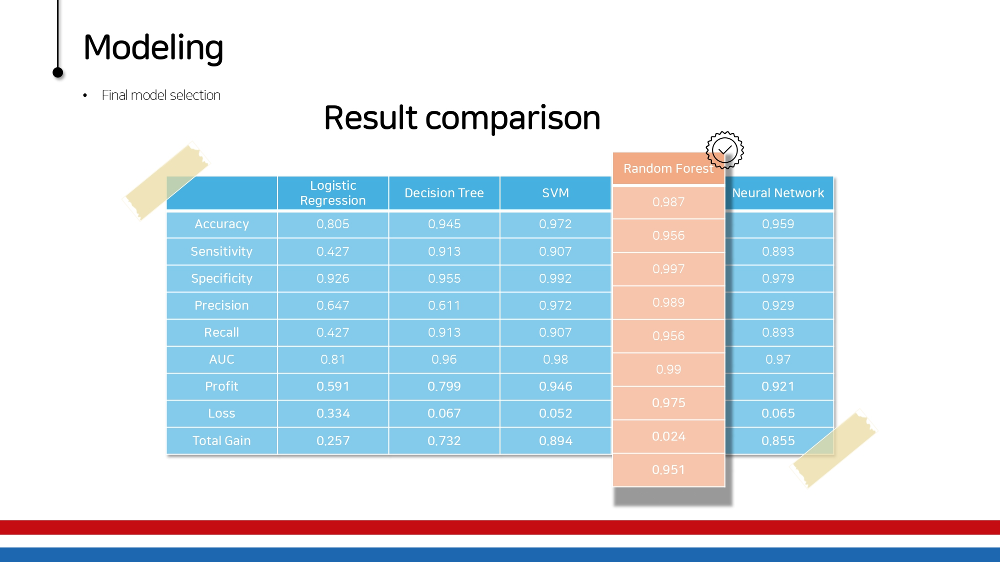

# Analyzing HR Data Using Machine Learning

This study explores the use of HR data to predict employee turnover using machine learning models. We collected HR data from 14,999 employees on Kaggle and applied various machine learning algorithms, including Logistic Regression, Decision Trees, Support Vector Machines, Random Forests, and Artificial Neural Networks. The goal of the analysis was to identify key factors influencing employee retention and turnover, comparing multiple machine learning models to determine the best fit.

---

## 1. Introduction
The study analyzes HR data to predict employee turnover and retention using machine learning models. Key objectives include:
- Identifying the most influential variables affecting employee turnover.
- Comparing various machine learning models to determine the best-performing model.

---

## 2. Data Exploration
| Data Type    | Variable Name           | Variable Description                                           |
|--------------|-------------------------|-----------------------------------------------------------------|
| **Categorical** | left                 | Whether the employee left (0 = No, 1 = Yes)                    |
|              | work Accident          | Work accident (0 = No accident, 1 = Accident occurred)         |
|              | promotion last 5 years | Promotion in the last 5 years (0 = No, 1 = Yes)                |
|              | salary                 | Salary (low, medium, high)                                     |
|              | department             | Department (Sales, Support, Technical, etc.)                  |
| **Continuous**  | number project       | Number of projects the employee worked on                     |
|              | time spend company     | Years spent in the company                                    |
|              | satisfaction level     | Employee satisfaction (0 = low, 1 = high)                     |
|              | last evaluation        | Manager's evaluation (0 = low, 1 = high)                      |
|              | average monthly hours  | Average hours worked per month (96 hours – 310 hours)          |

---

## 3. Feature Selection and Machine Learning Models
### Feature Selection Process
To enhance model accuracy and interpretability, we applied a two-step approach across **all machine learning models**:

1. **Initial Baseline Models**:  
   Each machine learning model was first trained using all variables in the dataset to identify the most important features contributing to employee turnover.

2. **Feature Importance Extraction**:  
   Using feature importance plots or coefficients from each baseline model, we identified the key variables that consistently influenced predictions across models. These top variables were then used to train the **final models**, ensuring better performance and reduced complexity.

This approach ensured that every model was optimized based on its own understanding of variable importance, and all models were fairly evaluated on the same refined set of variables.

### 3.1 Linear Regression Model
**Top important variables:**
- Satisfaction level
- Time spent at the company
- Work accident
- Salary
- Number of projects

---

### 3.2 Decision Tree Model
**Top important variables:**
- Satisfaction level
- Number of projects
- Average monthly hours
- Time spent at the company
- Last evaluation score

---

### 3.3 Support Vector Machine Model
**Top important variables:**
- Satisfaction level
- Time spent at the company
- Salary
- Work accident
- Average monthly hours

---

### 3.4 Random Forest Model
**Top important variables:**
- Satisfaction level
- Number of projects
- Last evaluation score
- Time spent at the company
- Average monthly hours

---

### 3.5 Neural Network Model
**Top important variables:**
- Time spent at the company
- Number of projects
- Last evaluation score
- Satisfaction level
- Average monthly hours

---

## 4. Selecting the Best Model

Considering the company’s perspective, we created a new metric called **Total Gain** by combining profit and loss hypotheses from the company’s perspective. It combines profit and loss hypotheses using the following formulas:

### Profit:
*Profit* = 0.4 × *PPV* + 0.4 × *TPR* + 0.2 × *Accuracy*

### Loss:
*Loss* = 0.5 × *Error* + 0.4 × *FNR* + 0.1 × *FPR*

### Total Gain:
*Total Gain* = *Profit* - *Loss*

---

**Random Forest Model Performance:**
- Prediction success rate: **98.8%**
- Error rate for employees staying (not leaving): Close to **0%**

## 5. Conclusion
From the company’s perspective, **employee satisfaction**, **tenure**, and **average monthly working hours** had a more significant impact on employee attrition than salary. 

### Key Findings:
1. The **Random Forest model** consistently outperformed other models, with employee satisfaction being the most influential variable.
2. Employees with both low and high average monthly working hours showed a higher likelihood of leaving:
   - **Low working hours:** Often handled fewer projects, leading to lower achievement.
   - **High working hours:** Likely managed more projects, causing burnout and stress.
3. Surprisingly, salary had less influence on turnover than expected, suggesting that non-financial factors play a larger role in employee retention.

---

data: <https://www.kaggle.com/mfaisalqureshi/hr-analytics-and-job-prediction?select=HR_comma_sep.csv>
